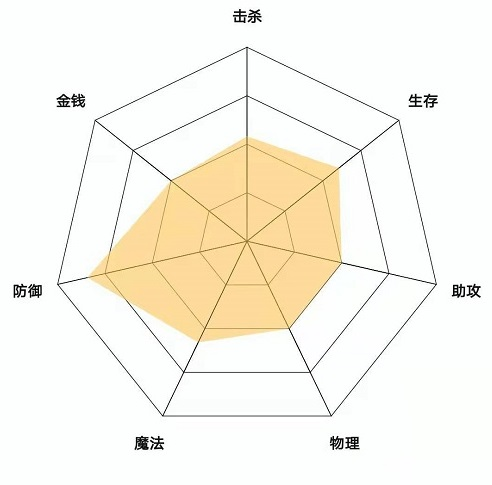
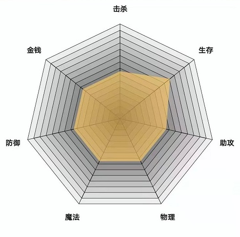

	# RadarView
雷达图控件
<br>


</img>
</img>
</img>
</img>


# 原理解析
**RadarView绘制原理分解：**<br><br>
</img>
</img>
</img>
</img>
<br>
<!--<table border="0">
	<tr class = "img_border" width = 800>
		<td width = 200  style = "text-align: center;">例图</td>
		<td width = 200  style = "text-align: center;">例图</td>
		<td width = 200  style = "text-align: center;">例图</td>
		<td width = 200  style = "text-align: center;">例图</td>
	</tr>
</table>
-->
# 项目配置

```
  allprojects {
      repositories {
          ...
          maven { url 'https://jitpack.io' }  //添加jitpack仓库
      }
  }
  
  dependencies {
	  implementation 'com.github.bigdongdong:RadarView:1.0' //添加依赖
  }
```

# 使用方式
```java
        /*文字样式*/
        TextOptions textOptions = new TextOptions.Builder()
                .textColor(Color.parseColor("#121514"))                   //文字颜色
                .textSize(12)                                             //文字尺寸（sp）
                .isBold(true)                                             //文字是否加粗
                .build();
                
        /*蛛网填充颜色*/
        int[] colors = new int[]{Color.parseColor("#d4f1f0"),
                Color.parseColor("#9cdce0"),Color.parseColor("#58c0c9"),
                Color.parseColor("#2b898e")} ;
        /*蜘蛛网样式*/
        CobwebOptions cobwebOptions = new CobwebOptions.Builder()
                .petal(7)                                           //蛛网瓣数
                .silkWidth(2)                                       //蛛丝宽度
                .silkColor(Color.BLACK)                             //蛛丝颜色
                .level(4)                                           //蛛网的层数
                //优先采取此方案适配颜色
                .cobwebLevelColors(colors)                          //自外向内，每层蛛网的填充颜色
                //次选此方案适配颜色
//                .centerColorStr("#770077")                        //蛛网中心颜色
//                .peripheralColorStr("#66DD00")                    //蛛网边缘颜色
                .build();
                
        /*数据线样式*/
        DataLineOptions options = new DataLineOptions.Builder()
                .lineColor(Color.parseColor("#AAFFCC66"))  //数据线的颜色
                .lineWidth(8)                                        //数据线的宽度
                .isFill(true)                                        //数据线是否填充成面，默认false
                .build();

        /*生成雷达控件*/
        RadarView radarView = new RadarView.Builder()
                .context(this)
                .backgroundColor(Color.parseColor("#fafffe"))      //整个控件背景颜色
                .textOptions(textOptions)                                    //文字样式
                .cobwebOptions(cobwebOptions)                                //蛛网样式
                .maxValue(100)                                               //数据最大数值
                .textCanvasScale(0.9f)                                       //文字画布缩放比例（0~1f），默认0.9f
                .cobwebCanvasScale(0.7f)                                     //蛛网画布缩放比例（0~1f），默认0.7f
                .texts(new String[]{"击杀","生存","助攻",
                        "物理","魔法","防御","金钱"})                         //文字数组，长度与CobwebOptions.petal一致
                .build();

        /*随机生成数据*/
        float[] values = new float[7];
        for(int i = 0 ; i < values.length ; i++){
            values[i] = (float) Math.max(50,Math.random() * 100);
        }

        //添加一条数据线，（可以添加多条数据，设置每条数据的样式）
        radarView.addLine(options,values);

        //将radarView添加进父布局
        parentView.addView(radarView);
```
